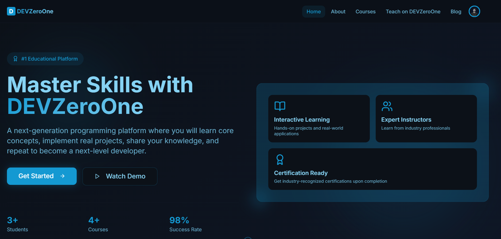

# DEVZeroOne - A Next Gen E-tech Platform

DEVZeroOne is a comprehensive educational platform built with the MERN stack (MongoDB, Express.js, React, Node.js) that revolutionizes the way educational institutions, tutors, and students interact. Our platform makes skill learning and class management more efficient and accessible than ever before.

- **Student Username | Password**: student@devzeroone.com | Student123
- **Teacher Username | Password**: teacher@devzeroone.com | Teacher123
- **Admin Username | Password**: admin@devzeroone.com | Admin123

## ✨ Key Features

• **Authentication System** - Secure login/register with Firebase Auth + JWT tokens
• **Role-Based Access Control** - dashboards for Students, Teachers, and Admins
• **Class Management** - Teachers can create, edit, and manage their courses
• **Advanced Search & Filtering** - Real-time search functionality for all classes
• **Secure Payment Integration** - Complete payment flow for class enrollment
• **Assignment Management System** - Teachers can create assignments, students can submit
• **Real-time Statistics Dashboard** - Track enrollments, assignments, & submissions
• **Become A Instructor** - Users can apply to become teachers with admin approval

## 🎯 User Roles & Features

### 👨‍🎓 Students

- Browse and search available classes
- Enroll in classes with secure payment
- View enrolled classes and assignments
- Submit assignments with deadline tracking
- Provide feedback and ratings for teachers

### 👨‍🏫 Teachers

- Apply for teacher status (requires admin approval)
- Create and manage classes
- Set class pricing and descriptions
- Create and manage assignments
- View class statistics and enrollment data

### 👨‍💼 Admins

- Approve/reject teacher applications
- Manage all users and promote to admin
- Approve/reject class submissions
- View platform-wide statistics
- Monitor class progress and assignments

### 🛠️ Tech Stack

- **React 19** with TypeScript
- **Redux Toolkit** for state management
- **React Router** for navigation
- **TanStack Query** for data fetching
- **React Hook Form** for form management
- **Framer Motion** for animations
- **Tailwind CSS** for styling
- **Shadcn/ui** for component library

### Development Tools

- **Vite** for fast development
- **ESLint, Huksy & Prettier** for code linting
- **TypeScript** for type safety
- **SweetAlert2** for dialog
- **sonner** for notifications

### Quick Start Commands

```bash
# Clone the repository
git clone <your-repository-url>
cd devzeroone

# Install dependencies
npm install

# Set up environment variables
cp .env.example .env
# Edit .env with your configuration

# Start development server
npm run dev

# Build for production
npm run build

# Preview production build
npm run preview
```

## 📁 Project Structure

```
src/
├── components/          # Reusable UI components
│   ├── ui/             # Shadcn UI components
│   └── ...             # Custom components
├── pages/              # Application pages
│   ├── dashboard/      # Dashboard pages
│   └── ...             # Public pages
├── services/           # API service functions
├── store/              # Redux store and slices
├── hooks/              # Custom React hooks
├── config/             # Configuration files
├── data/               # Mock data and constants
└── lib/                # Utility functions
```

**Built with ❤️ by the DEVZeroOne Team**
